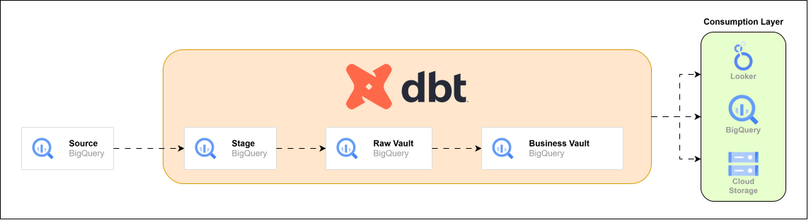

# Data Vault Modeling using dbt & AutomateDV

A Data Vault 2.0 implementation project that leverages **dbt** and **AutomateDV** package for creating end-to-end pipeline from source to business vault for an electronic parts distribution company.

## Notes:
- Business Vault implementation is still WIP
- HASHDIFF columns are defined in models but need to be updated in the diagrams.
- Consumption Layer views need to be added also [ I will do it when I get time :) ]

## Architecture



## Data Vault Model

The project implements a Data Vault 2.0 architecture with three main layers:

#### 1. Stage Layer
- Standardized staging of source data
- Basic data type conversions
- Initial data quality checks
- Source system audit columns

#### 2. Raw Vault Layer
- **Hubs:** Core business entities (buyers, parts, suppliers, countries, markets)
- **Links:** Business relationships and transactions
- **Satellites:** Descriptive attributes and historical tracking

#### 3. Business Vault Layer
- Business rules implementation
- Derived calculations
- Aggregated metrics

### Table Layers:


### Raw Vault Model:


## Dependencies

- dbt-core
- automate_dv (Data Vault automation package)

## Getting Started

1. **Environment Setup**
```bash
python -m venv dbt-venv
source dbt-venv/bin/activate  # Linux
.\dbt-venv\Scripts\activate   # Windows
```

2. **Install Dependencies**
```bash
dbt deps
```

3. **Run Models**
```bash
# Run all models
dbt run

# Run specific layers
dbt run --select stage
dbt run --select raw_vault
dbt run --select business_vault

# Run specific models
dbt run --select model_1 model_2
```

4. **Testing**
```bash
dbt test
```

## Model Naming Conventions

- Staging: `stg_<entity>.sql`
- Hubs: `hub_<entity>.sql`
- Links: `lnk_<entity1>_<entity2>.sql`
- Satellites: `sat_<entity>.sql`
- Business Vault: `dw_<entity>.sql`

## Project Folder Structure
```
models/
├── stage/                  # Raw staging models
│   ├── sources.yaml       # Source definitions
│   ├── stg_buyer.sql      # Buyer staging
│   ├── stg_country.sql    # Country staging
│   ├── stg_market.sql     # Market staging
│   ├── stg_order.sql      # Order staging
│   ├── stg_part.sql       # Part staging
│   ├── stg_sale.sql       # Sale staging
│   └── stg_supplier.sql   # Supplier staging
│
├── raw_vault/             # Raw Data Vault 2.0 models
│   ├── hubs/             # Business entity hubs
│   │   ├── hub_buyer.sql
│   │   ├── hub_country.sql
│   │   ├── hub_market.sql
│   │   ├── hub_order.sql
│   │   ├── hub_part.sql
│   │   ├── hub_sale.sql
│   │   └── hub_supplier.sql
│   │
│   ├── links/            # Relationship links
│   │   ├── lnk_buyer_country.sql
│   │   ├── lnk_buyer_market.sql
│   │   ├── lnk_buyer_sale.sql
│   │   ├── lnk_part_country.sql
│   │   ├── lnk_part_order.sql
│   │   ├── lnk_part_sale.sql
│   │   ├── lnk_part_supplier.sql
│   │   ├── lnk_supplier_country.sql
│   │   ├── lnk_supplier_market.sql
│   │   └── lnk_supplier_order.sql
│   │
│   └── sats/             # Descriptive satellites
│       ├── sat_buyer.sql
│       ├── sat_country.sql
│       ├── sat_market.sql
│       ├── sat_order.sql
│       ├── sat_part.sql
│       ├── sat_sale.sql
│       └── sat_supplier.sql
│
└── business_vault/        # Business vault models
    ├── dw_part_inv.sql
    ├── dw_vendor.sql
    └── dw_gross_rev.sql

```

## Documentation

For detailed model documentation and lineage:
```bash
dbt docs generate
dbt docs serve
```

## Resources

- [dbt Documentation](https://docs.getdbt.com)
- [Data Vault 2.0 Documentation](https://www.datavaultalliance.com/)